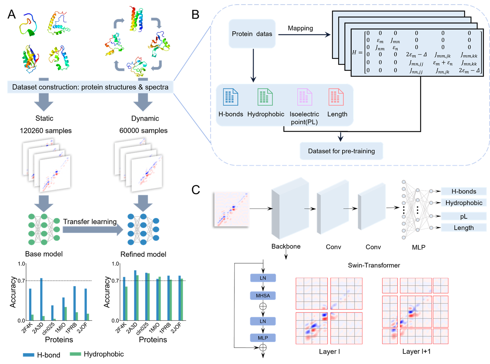
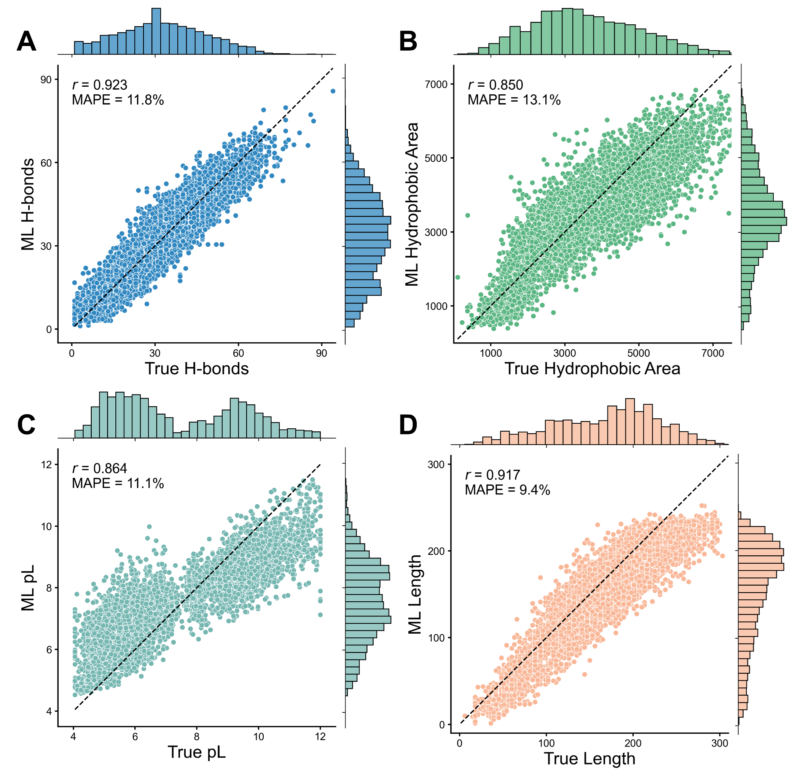
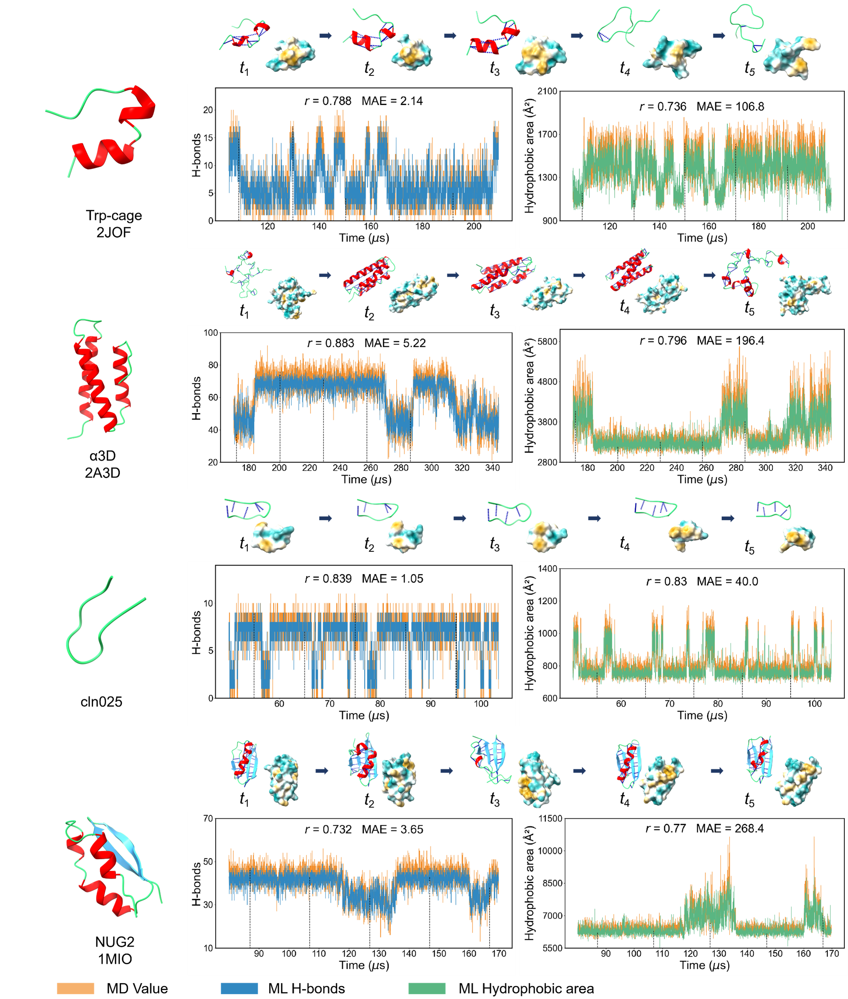

# Dynamic Prediction of Protein Physicochemical Properties Using 2D IR Spectroscopy with Machine Learning  

## Overview  

This repository contains the source code for our study, which employs **2D infrared (IR) spectroscopy** as a machine learning descriptor to predict the physicochemical properties of proteins. By leveraging the spectral signal as input, our model effectively extracts meaningful physicochemical information from previously unseen 2D IR spectra, facilitating a deeper understanding of protein characteristics.  

This work aims to address two key scientific challenges:
1. **Feature Extraction from Spectral Data**: Developing machine learning techniques capable of capturing physicochemical properties embedded within complex spectral signals.  
2. **Application to Protein Folding Dynamics**: Extending the predictive framework to model the dynamic folding processes of proteins, offering insights into their physicochemical properties changes.  

  
<!-- 这里插入一张概览图片，展示研究框架或关键实验示意图 -->

---

## Repository Structure  

The repository consists of the following key components:  

- `config.py` – Defines hyperparameters and experiment settings.  

- `model.py` – Loads and modifies a pre-trained **Swin Transformer** model to adapt it for the specific task of spectral data analysis.  

- `dataload.py` – Handles data preprocessing, including loading, normalization, and transformation of 2D IR spectral data.  

- `train_base_model.py` – Implements training procedures for the **baseline model**, which learns from raw spectral data.  

- `train_transfer_model.py` – Implements **transfer learning**, allowing the model to generalize across different spectral datasets.  

- `test_base_model.py` – Evaluates the performance of the **baseline model**, generating results and key performance metrics.  

- `test_transfer_model.py` – Evaluates the **transfer learning model**, providing insights into its generalization ability across different datasets.  

---

## Dataset  

The dataset used in this study is hosted on **Zenodo**, providing easy access and ensuring academic reproducibility.  

📥 [Download Dataset from Zenodo](https://zenodo.org/record/xxxxx)  

After downloading, extract the dataset into the `data/` directory:  

```bash
mkdir data
mv downloaded_dataset.zip data/
unzip data/downloaded_dataset.zip
```

---

## Usage  

Run the baseline model training with:  

```bash
python train_base_model.py --config configs/base_config.yaml
```

Train the transfer learning model with:  

```bash
python train_transfer_model.py --config configs/transfer_config.yaml
```

To evaluate a trained model:  

```bash
python model.py --input data/test_spectra/
```

---

## Results  

  

  

---

## Citation  

If you use this code, please cite our work as follows:  

```bibtex
@article{yourpaper2025,
  author    = {Your Name and Collaborators},
  title     = {Dynamic Prediction of Protein Physicochemical Properties Using 2D IR Spectroscopy with Machine Learning},
  journal   = {Conference Name},
  year      = {2025},
  doi       = {10.xxxx/xxxx}
}
```

---

## License  

This project is licensed under the MIT License - see the [LICENSE](LICENSE) file for details.  

---

## Contact  

For any questions or inquiries, please contact:  

📧 Email: feiyufei859@gmail.com  
Or open an issue in this repository.  
```

---
